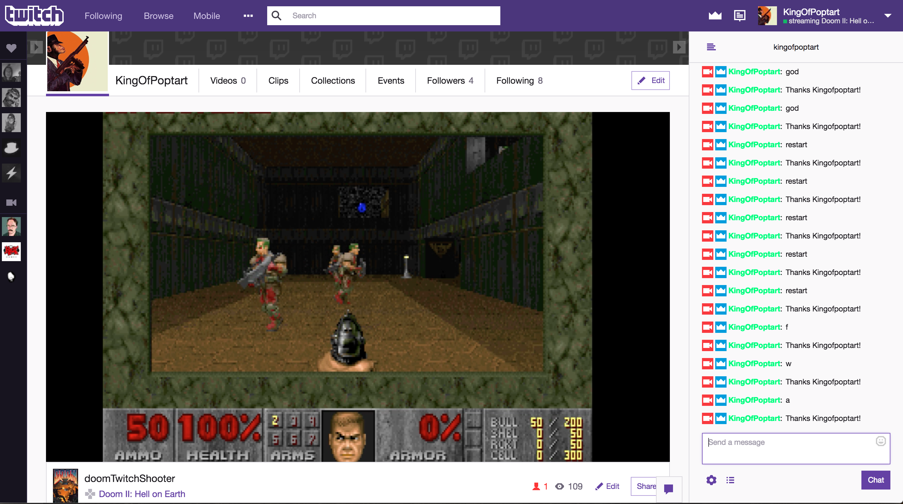

# doomTwitchShooter

Streaming at https://www.twitch.tv/kingofpoptart off my poor, beaten laptop



## Setup

Tested and run on OSX 10.12.5

* Get this repo
  * `git clone https://github.com/KingOfPoptart/doomTwitchShooter`
  * `cd doomTwitchShooter`
* Download Doom WAD files to ./wads/
  * Only tested on Doom1 so far
* Setup Prereqs, download and build restful-doom
  * `./setupPrereqs.sh`
* To launch Restful Doom:
  * `./runRestfulDoom.sh`
* To launch ircBot:
  * `./doomTwitchShooter/doomTwitchShooter.py`


## Config
```
#Config file stored at ~/.twitch
sleepTime: 1

twitch:
  host: irc.chat.twitch.tv
  port: 6667
  ircPing: tmi.twitch.tv

chat:
  oauth: [oauth from https://twitchapps.com/tmi/]
  username: [you user name]
  channel: [channel to join]
  chatMessageRegex: "^:\\w+!\\w+@\\w+\\.tmi\\.twitch\\.tv PRIVMSG #\\w+ :"
```

## Twitch Control Scheme
```
w: move forward
s: move backwards
a: look left
d: look right

0-9: switch weapons
f: shoot
r: open/use
god: toggle godmode
restart: load random level
```


## Acknowledgements
IRC/Twitch logic shamelessly stolen from https://pastebin.com/F0QKdZeB

Thanks to dddanmar for collaboration, and jeff-1amstudios for implementing restful-doom

Restful Doom - https://github.com/jeff-1amstudios/restful-doom/

